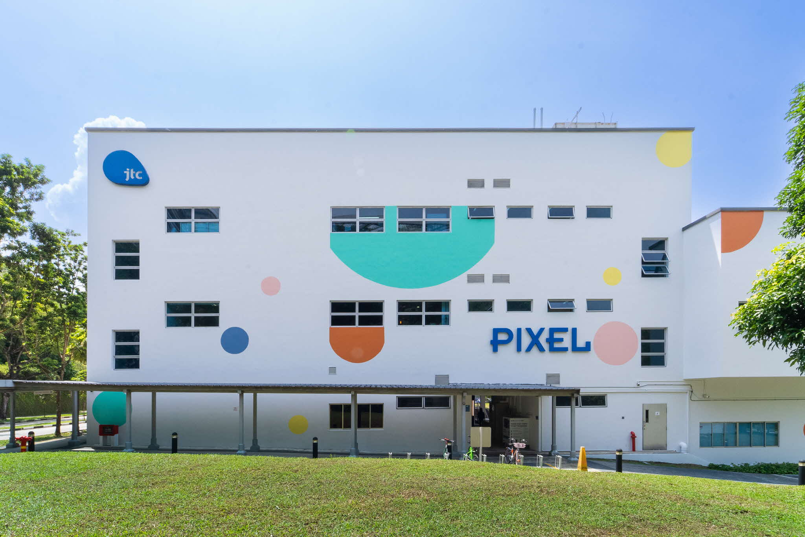

# Venues

You may refer to the [TechUp calendar ](../tech-up-calendar.md)during the programme for the most up-to-date venues for each session, but broadly:

1. All in-person workshops and sessions will be held at **MND Office Towers @ JEM** and **IMDA PIXEL.**
   1. On training days conducted at MND Office Towers @ JEM, Attendees are to register with the security counter on Level 1.
   2. A security pass would be issued to you at the security counter and is to be returned at the end of the day.
   3. If you have any issues with accessing the building, please [contact us](contact-persons.md).
2. Web App Presentations on 26 to 28 May 2025 are held at **MDDI @ Hill Street**. The room allocations will be briefed to you nearer the date.
3. Demo Day on 29 May 2025 will be at **MDDI Atrium** (public access is possible).

### Additional Notes: 

* **Please be punctual for all sessions** out of respect to the speakers who have put in the effort to make this programme fruitful for you.&#x20;
* If you intend to take taxi / private hire cars, please cater for sufficient buffer time. **You are also highly encouraged to carpool.** Do also make use of the #carpool channel (search: Carpool on Slack) to look for others living near you to carpool to MND Office Towers @ JEM and IMDA PIXEL for financial prudence. Please adhere to the transport claim guidelines for your respective agency.

### How to get there



**Address**

52 Jurong Gateway Road, Singapore 608550

**Access**

Entrance to MND Office towers are on the ground floor (outside the mall, facing the road). Please register at the ground floor to receive an access card from the registration booth. Proceed to 17th or 6th floor for in-person sessions. Should you need to leave the building, please drop your card into the electronic gantry slot to exit. Access card is required should you need to re-enter the building.

**Public Transport**

Nearest MRT station: Jurong East By Car: Exit 27 on PIE or Exit 11 on AYE By Taxi: Drop off at JEM Mall Taxi Stand By Bus: 5 min walk away from temporary Jurong East Bus Interchange

**Parking Information** Carpark entrance is at Jurong Gateway Road. There are 669 car park bays at B2 & B3.

Please see below for the parking charges at JEM:

<figure><figcaption></figcaption></figure>



<figure><figcaption>
IMDA PIXEL
</figcaption></figure>

**Address**

10 Central Exchange Green,
&#x20;Singapore 138649

**Access**

Publicly accessible

**Public Transport**

Nearest MRT station: One North, Exit B

**Parking Information**

Limited Parking, charges apply. Alternative parking at Fusionopolis



**Address**

140 Hill Street #01-01A. Singapore 179369

**Access**

Publicly accessible

**Public Transport**

Nearest MRT station: Clarke Quay, City Hall

**Parking Information**

We highly encourage participants to take public transport due to limited parking available. MCI parking lots are reserved for VIPs. Alternatively, you may wish to park at Clark Quay, which is free for the first 2 hours.


